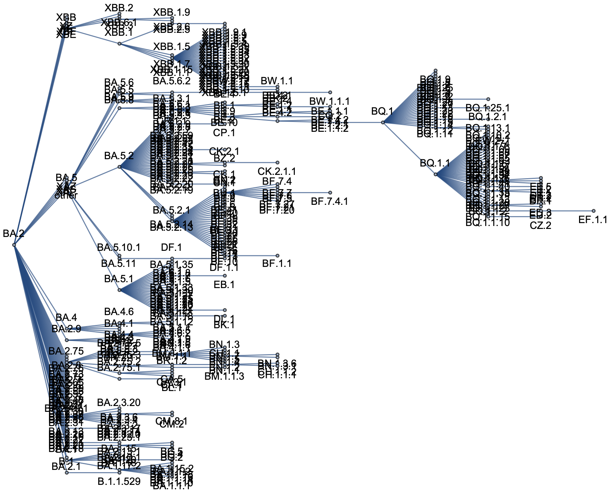
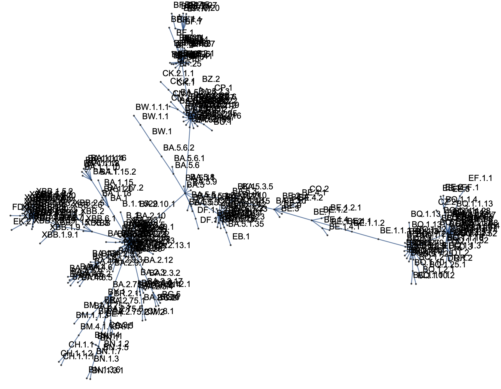

## Pango lineages dataset

This dataset only includes Pango lineages with >150 sequences in US dataset. Rarer Pango lineages are collapsed into parental lineages, ie BM.1 was collapsed into BA.2.75.3. This collects sequences between 2022-03-01 and 2023-03-01.

Dataset was provisioned by running https://github.com/nextstrain/forecasts-ncov with the following modified config:

```
data_provenances:
  - gisaid
variant_classifications:
  - pango_lineages
geo_resolutions:
  - global

# Params for the prepare data scripts
# Define params for each data_provenance / variant_classification / geo_resolution combination
# Include max_date if you don't want to use today as the max date
prepare_data:
  gisaid:
    pango_lineages:
      global:
        max_date: 2023-03-01
        included_days: 365
        location_min_seq: 500000
        location_min_seq_days: 365
        excluded_locations: "defaults/global_excluded_locations.txt"
        prune_seq_days: 12
        clade_min_seq: 1
        clade_min_seq_days: 365
        collapse_threshold: 150

# Params for the model run scripts
models:
    pango_lineages:
      global:
        pivot: "BA.2"

# Model configs
mlr_config: "config/mlr-config.yaml"
```

I also added `United Kingdom` to `defaults/global_excluded_locations.txt`.

This produces the file `data/gisaid/pango_lineages/global/collapsed_seq_counts.tsv` that can be used in subsequent analyses. This file was renamed to `pango_seq_counts.tsv` and versioned here.

These files represent heavily derived GISAID data and are equivalent to downloadable results from [outbreak.info](https://outbreak.info), [cov-spectrum.org](https://cov-spectrum.org) and [covariants.org](https://covariants.org). This use is allowable under the [GISAID Terms of Use](https://www.gisaid.org/registration/terms-of-use/).

------------------------------------------

The file `pango_variant_relationships.tsv` is produced by running `pango-relationships.nb` and looks like:
```
BG.4	 BA.2.12.1
BG.5	 BA.2.12.1
BK.1	 BA.5.1.10
BQ.1	 BE.1.1.1
BQ.1.1 BQ.1
BU.2	 BA.2
```
This contains a mapping of each collapsed Pango lineage to its parent lineage. I've set the reference here as BA.2, so that we have BA.2 → BA.1, BA.2 → BA.4 and BA.2 → BA.5 contrasts even if this is was not the historical evolutionary path. I've chosen this because we have immune escape and ACE-2 binding measured relative to BA.2 and so it makes the most sense to have BA.2 as baseline in the MLR model. Pictorial view below:




